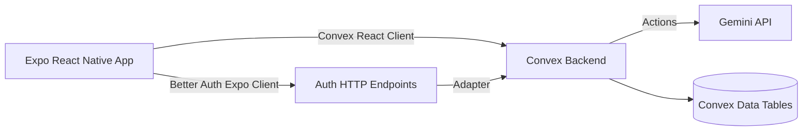

# Grocery Pal

Grocery Pal is a production-oriented mobile app for household grocery expense management.
It helps users track monthly spending, store order history, analyze trends, collaborate on shared shopping lists, and speed up item entry through image-based scan assistance.

This repository is a Bun-first Turborepo monorepo with:

- a React Native mobile app (Expo + Expo Router)
- a Convex backend (realtime database + server functions)
- authentication powered by Better Auth integrated with Convex

## Why this app exists

Most grocery tracking flows are either too lightweight (just checklists) or too heavy (full budgeting suites).
Grocery Pal focuses on a practical middle ground:

- Month-level budgeting with fast order capture
- Useful analytics without spreadsheet overhead
- Collaborative shopping for households/roommates
- AI-assisted scan flow for reducing manual data entry

## Product capabilities

- Secure sign-up/sign-in with user-scoped data ownership
- Monthly ledgers with totals, order count, and item count
- Order entry via:
  - manual review flow
  - image scan flow (Gemini-powered extraction + product matching)
- Order categorization with user-managed category taxonomy
- Trend and composition analytics (monthly comparison + category mixes)
- Shared list collaboration:
  - create/join lists
  - invite by token or link
  - edit/check off items collaboratively
  - convert completed list to an order
- Theme preference support and robust runtime URL handling for Expo Go/dev LAN scenarios

## Architecture



### Workspace layout

- apps/mobile
  - Expo app UI, routing, auth client, and test suite
- packages/backend
  - Convex deployment package
  - domain functions under packages/backend/convex

### Core backend modules

- months.ts: create/list user months
- orders.ts: order lifecycle and item persistence
- orderCategories.ts: category defaults and customization
- analytics.ts: monthly KPIs and comparison data
- sharedLists.ts: collaboration, invites, activity events, and order conversion
- scan.ts: image processing action via Gemini
- auth.ts + betterAuth/: auth integration and user identity resolution
- migrations.ts: Supabase-to-Convex import helpers

## Tech stack

- Runtime and tooling: Bun, Turborepo, TypeScript, Biome
- Mobile: Expo 55, React Native 0.83, React 19, Expo Router
- Styling: NativeWind (Tailwind for RN)
- Backend: Convex (queries, mutations, actions, auth adapter)
- Authentication: Better Auth + @convex-dev/better-auth
- AI scan enrichment: Gemini 2.5 Flash API
- Testing: Vitest + convex-test
- Delivery: EAS Build, EAS Update, EAS Submit

## Data model highlights

Convex schema includes:

- products
- months
- orders
- order_items
- order_categories
- shared_lists
- shared_list_members
- shared_list_items
- shared_list_invites
- shared_list_activity_events
- Better Auth component tables

Design notes:

- Most business tables are user-scoped
- Shared product records can be overridden per user (fork-on-edit behavior)
- Shared list lifecycle supports archive/restore and conversion to orders

## How the app is built (end to end)

1. The mobile app initializes Convex and Better Auth clients from runtime-safe public URLs.
2. Route guards redirect unauthenticated users to auth screens.
3. Screens load data through Convex live queries and local cached query wrappers for smoother UX.
4. Writes go through Convex mutations, keeping database logic centralized and typed.
5. Scan workflows send base64 image payloads to a Convex action that calls Gemini, normalizes JSON, and reconciles with known products.
6. Analytics screens aggregate monthly totals and category splits from backend queries.
7. Shared list workflows enforce access control server-side, emit activity events, and support invite acceptance and list-to-order conversion.

## Getting started

### Prerequisites

- Bun 1.3+
- Expo-compatible iOS simulator or Android emulator/device
- Convex account/project

### 1) Install dependencies

```bash
bun install
```

### 2) Configure environment variables

Create environment files as needed (for example, root and/or app package scope depending on your workflow).

Mobile app variables:

- EXPO_PUBLIC_CONVEX_URL
- EXPO_PUBLIC_CONVEX_SITE_URL

Backend/auth variables:

- BETTER_AUTH_SECRET
- CONVEX_SITE_URL (or SITE_URL fallback)
- GEMINI_API_KEY (required for scan feature)
- JWKS (optional for specific auth/JWT setups)

### 3) Start local development

Terminal 1:

```bash
bun run convex:dev
```

Terminal 2:

```bash
bun run dev
```

Other useful app targets:

```bash
bun run android
bun run ios
bun run web
```

## Quality and testing

Workspace checks:

```bash
bun run turbo:check
```

Individual checks:

```bash
bun run turbo:lint
bun run turbo:typecheck
bun run turbo:test
```

Mobile package test run:

```bash
bun run --cwd apps/mobile test
```

## Deployment and release

Convex backend:

```bash
bun run convex:deploy
```

EAS commands:

```bash
bun run eas:whoami
bun run eas:build:preview:android
bun run eas:build:prod:android
bun run eas:build:prod:ios
bun run eas:update:preview
bun run eas:update:production
bun run eas:submit:android
bun run eas:submit:ios
```

## Resume-oriented engineering highlights

- Architected a full-stack, realtime expense tracking system in a monorepo with shared TypeScript contracts.
- Implemented secure auth and route protection with Convex + Better Auth across mobile and backend boundaries.
- Built collaborative list workflows with permission checks, invite tokens, and event tracking.
- Added AI-assisted image scan ingestion with structured JSON extraction and catalog reconciliation.
- Designed analytics queries that convert transactional order data into actionable monthly insights.
- Established CI-friendly quality gates with lint/typecheck/test scripts and environment-aware release workflows.

## Notes

- Current auth UX is focused on native iOS/Android usage.
- Products management UI is marked as a future enhancement while category management is already available.
